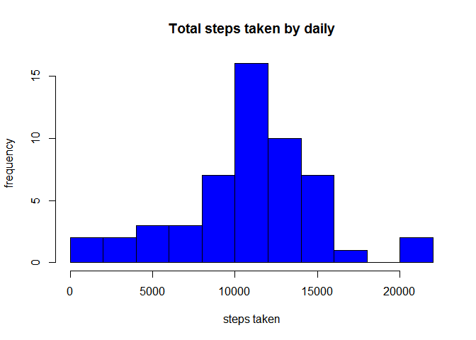
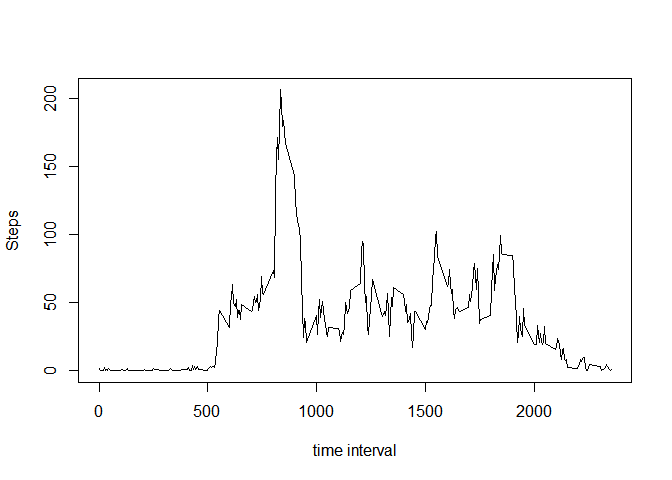
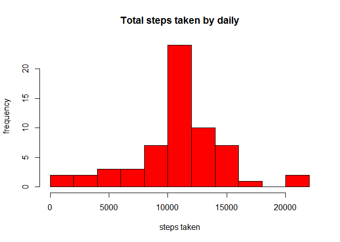
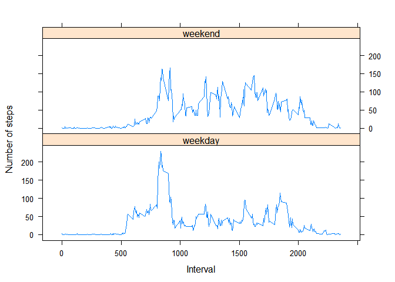

# Reproducible Research: Peer Assessment 1


## Loading and preprocessing the data

Show any code that is needed to

1. Load the data (i.e. read.csv())


```r
library(data.table)

raw.activity <- read.csv("activity.csv")

activity <- na.omit(raw.activity)

actData <- data.table(activity)
```

2. Process/transform the data (if necessary) into a format suitable for 
your analysis


```r
actData <- actData[,steps:=as.numeric(steps)]
actData <- actData[,date :=as.Date(date)]
```


## What is mean total number of steps taken per day?

For this part of the assignment, you can ignore the missing values in the 
dataset.

1. Calculate the total number of steps taken per day


```r
plotdata <- actData[,sum(steps), by=date]
setnames(plotdata, c("date","V1"), c("Date","TotalSteps"))
```

2. If you do not understand the difference between a histogram and a barplot, 
research the difference between them. Make a histogram of the total number of
steps taken each day


```r
hist(plotdata$TotalSteps, main="Total steps taken by daily", xlab="steps taken", 
     ylab="frequency", breaks=15, col="blue")
```

 

3. Calculate and report the mean and median of the total number of steps 
taken per day

Average steps taken per day 


```r
mean(plotdata$TotalSteps)
```

```
## [1] 10766.19
```


Median : 


```r
median(plotdata$TotalSteps)
```

```
## [1] 10765
```


## What is the average daily activity pattern?

What is the average daily activity pattern?

   1. Make a time series plot (i.e. type = "l") of the 5-minute interval 
   (x-axis) and the average number of steps taken, averaged across all days 
   (y-axis)


```r
library(plyr)
avg.steps.by.interval <- ddply(activity,~interval, summarise, avg=mean(steps))
 plot(avg.steps.by.interval$interval, avg.steps.by.interval$avg , 
      type="n", ylab="Steps", xlab="time interval" ) 
lines(avg.steps.by.interval$interval, avg.steps.by.interval$avg)  
```

 

2. Which 5-minute interval, on average across all the days in the dataset, 
contains the maximum number of steps?

Answer: Maximum Steps taken by Interval : 


```r
avg.steps.by.interval[avg.steps.by.interval$avg == max(avg.steps.by.interval$avg), "avg"]
```

```
## [1] 206.1698
```

## Inputing missing values

Inputing missing values

Note that there are a number of days/intervals where there are missing values (coded as NA). The presence of missing days may introduce bias into some calculations or summaries of the data.

Calculate and report the total number of missing values in the dataset (i.e. the total number of rows with NAs)

ANSWER: Number of days/intervals where there are missing values (coded as NA) is <span style="background-color:yellow"> 2304 </span>

    Devise a strategy for filling in all of the missing values in the dataset. The strategy does not need to be sophisticated. For example, you could use the mean/median for that day, or the mean for that 5-minute interval, etc.

    Create a new dataset that is equal to the original dataset but with the missing data filled in.
    

```r
mocked.activity <- merge(x=raw.activity, y=avg.steps.by.interval, by = "interval", all.x=TRUE)
mocked.activity <- cbind(mocked.activity, "mockedsteps" = ifelse(is.na(mocked.activity$steps), mocked.activity$avg, mocked.activity$steps))
mocked.activity$steps <- NULL
mocked.activity$avg <- NULL
mocked.activity <- rename(mocked.activity, c("mockedsteps"="steps"))
```

    Make a histogram of the total number of steps taken each day and Calculate and report the mean and median total number of steps taken per day. Do these values differ from the estimates from the first part of the assignment? What is the impact of imputing missing data on the estimates of the total daily number of steps?


```r
mock.table <- data.table(mocked.activity)
mock.table <- mock.table[,steps:=as.numeric(steps)]
mock.table <- mock.table[,date :=as.Date(date)]
plot.mock.data <- mock.table[,sum(steps), by=date]
setnames(plot.mock.data, c("date","V1"), c("Date","TotalSteps"))
hist(plot.mock.data$TotalSteps, main="Total steps taken by daily", xlab="steps taken", 
     ylab="frequency", breaks=15, col="red")
```

 

Average steps taken per day after filled N.As : 


```r
mean(plot.mock.data$TotalSteps)
```

```
## [1] 10766.19
```


Median steps after filled N.As : 


```r
median(plot.mock.data$TotalSteps)
```

```
## [1] 10766.19
```

<span style="background-color:yellow"> It shows filling NAs with interval-average has not much impact. </span>


## Are there differences in activity patterns between weekdays and weekends?

    Create a new factor variable in the dataset with two levels - "weekday" and "weekend" indicating whether a given date is a weekday or weekend day.

    Make a panel plot containing a time series plot (i.e. type = "l") of the 5-minute interval (x-axis) and the average number of steps taken, averaged across all weekday days or weekend days (y-axis). See the README file in the GitHub repository to see an example of what this plot should look like using simulated data.
    

```r
mock.table$weektype <- as.factor(ifelse(weekdays(mock.table$date) %in% c("Saturday","Sunday"), "weekend", "weekday"))

mock.table.by.weektype.and.interval <- mock.table[,mean(steps),by=c("weektype","interval")]
rename(mock.table.by.weektype.and.interval, c("V1"="avg"))
```

```
##      weektype interval        avg
##   1:  weekday        0 2.25115304
##   2:  weekend        0 0.21462264
##   3:  weekend        5 0.04245283
##   4:  weekday        5 0.44528302
##   5:  weekday       10 0.17316562
##  ---                             
## 572:  weekday     2345 0.26331237
## 573:  weekend     2350 0.02830189
## 574:  weekday     2350 0.29685535
## 575:  weekday     2355 1.41006289
## 576:  weekend     2355 0.13443396
```

```r
library(lattice)

p <- xyplot(avg ~ interval | factor(weektype), data=mock.table.by.weektype.and.interval, 
       type = 'l',
       main="Comparision of Average steps by Interval between weekend and weekdays",
       xlab="Interval in 5 minutes",
       ylab="Average # of Steps Taken")
print (p)
```

 

Findings: Theres more activity on weekends than weekdays.


## end of story.
